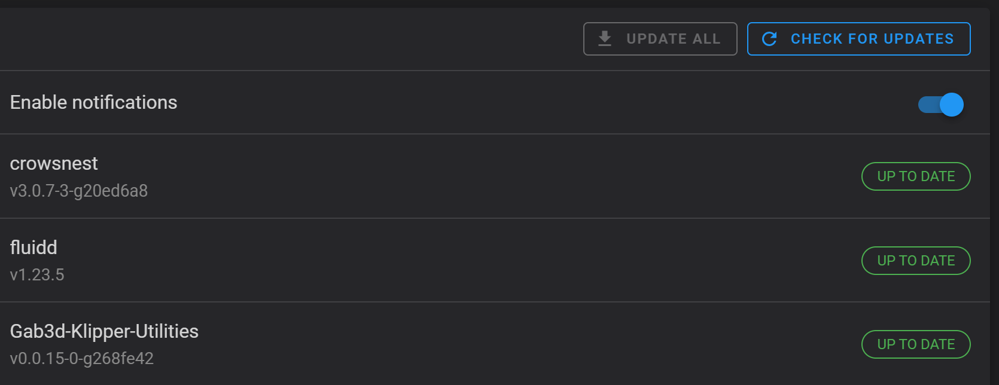
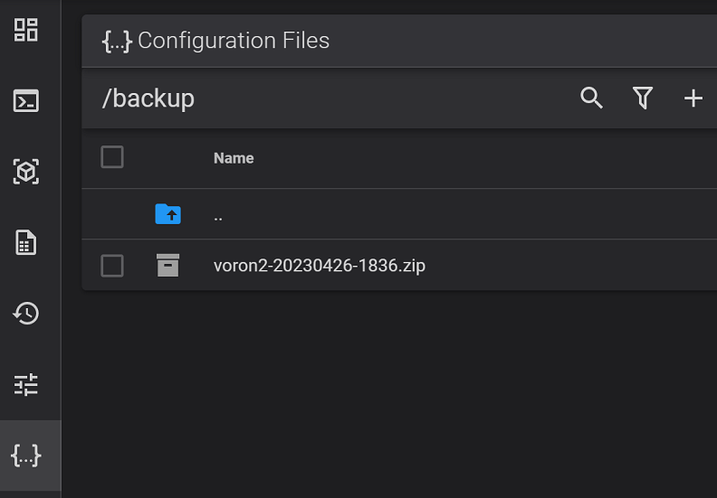

# Gab3d Klipper Utilities
 
To install it open a shell prompt (ssh or putty)

Use Kiauh to install shell command (if not already installed)

- option 4 (Advanced)
- option 8 (G-Code Shell Command)

If ask questions respond yes

Now run these 3 lines

```shell
cd ~
git clone https://github.com/gab-3d/Gab3d-Klipper-Utilities.git
bash ~/Gab3d-Klipper-Utilities/install.sh
```

After this you will see a new package in the software list and you can keep it updated over time



You will find the new macros in the macro list

If you don't see it restart moonraker and if still missing run again
```shell
cd ~
bash ~/Gab3d-Klipper-Utilities/install.sh
```


# Utilities included

## Backup klipper

It does a backup of
- ~/printer_data/config -- Excluding zip archives
- /etc/network/interfaces.d/can0
- ~/printer_data/moonraker.asvc
- files added to ~/klipper/klippy/extras

It save output under backup folder in config with hostname and the date in a zip file
I choose this directory because is simple to delete files and download 



## Generate png of input shaper results and install all requirements
Thanks to [Insane](https://github.com/insane78/) for developing these scripts

- GRAPH_SHAPER_XY
- GRAPH_SHAPER_X
- GRAPH_SHAPER_Y

After you start this macro the printer will home if not homed and will start the Input Shaper Calibration.

Resulsts are stored in the shaper folder inside configuration files for easy download


## PID helper
- PID_HOTEND
- PID_BED

These are two bonus macros for easy PID
Inspired from [Hartk](https://github.com/hartk1213)

## Generate diagnostic files

Generate a collection of log files usefull to debug
the macro is DIAG_CREATE 

This macro store the results in the backup folder

It collects:
    - Klippy log from last restart
    - Moonraker log from last restart
    - KlipperScreen log from last restart
    - crowsnest log from last restart

Add everything in a singke zip file

## Hidden macro _UPDATE_GAB_UTIL
The macro _UPDATE_GAB_UTIL run the installation script again
